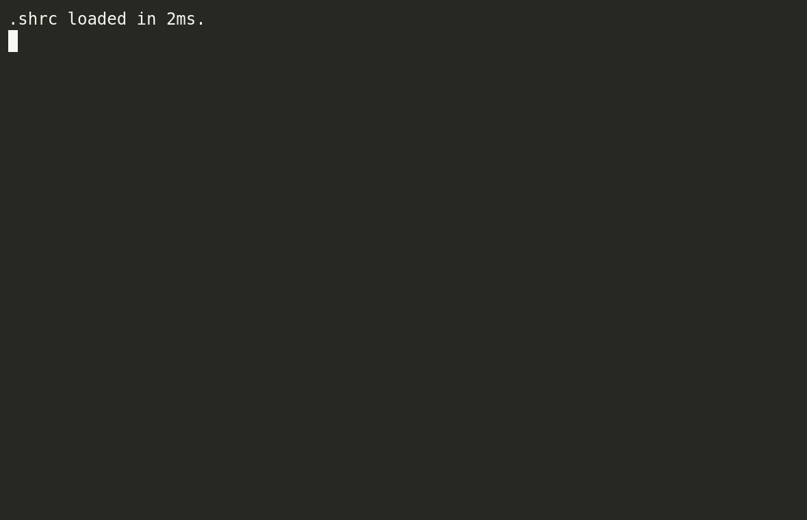

# polyglot-kube-ps1: Kubernetes integration for the [Polyglot Prompt](https://github.com/agkozak/polyglot) (`bash`/`zsh`)

If you use the [Polyglot Prompt](https://github.com/agkozak/polyglot) with `bash` or `zsh` and would like to have a Kubernetes indicator in your prompt, you can do so by using the [kube-ps1](https://github.com/jonmosco/kube-ps1) and polyglot-kube-ps1 scripts. Just clone the following repositories:

    https://github.com/agkozak/polyglot
    https://github.com/jonmosco/kube-ps1
    https://github.com/agkozak/polyglot-kube-ps1

and source them:

    . /path/to/polyglot.sh
    . /path/to/kube-ps1.sh
    . /path/to/polyglot-kube-ps1.sh

Alternatively, you may load them using a package manager.

polyglot-kube-ps1 displays your Kubernetes cluster and namespace above the Polyglot Prompt. The Kubernetes info is styled so as to fit in with the default Polyglot look and feel, but you may still use [kube-ps1 customizations](https://github.com/jonmosco/kube-ps1/blob/master/README.md#customization) by specifying them after you source the three scripts, e.g.

    KUBE_PS1_SYMBOL_ENABLE='true'     # Get that popular Unicode symbol back
    KUBE_PS1_CTX_COLOR='red'          # Make the cluster color red
